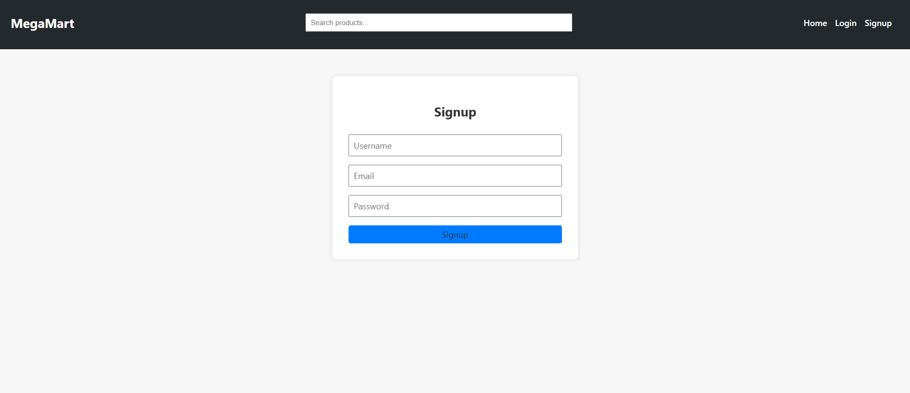
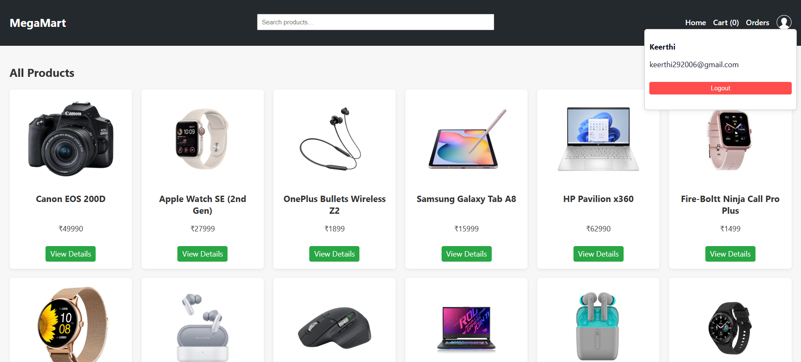
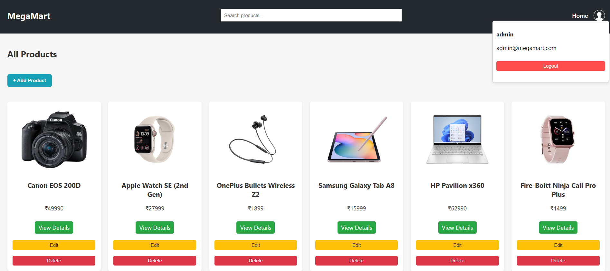
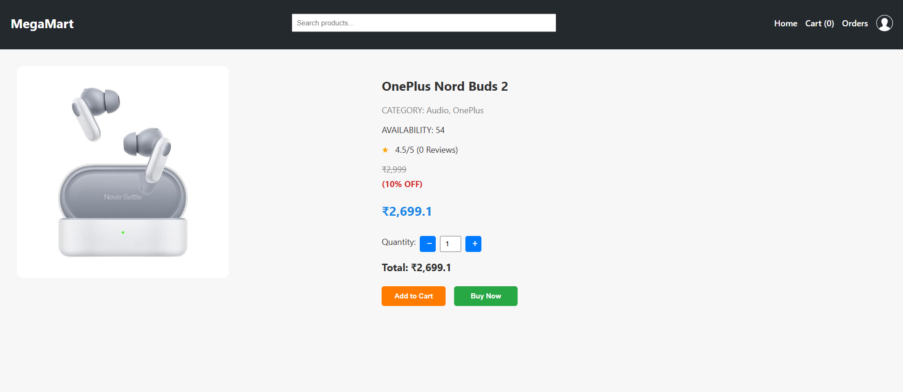
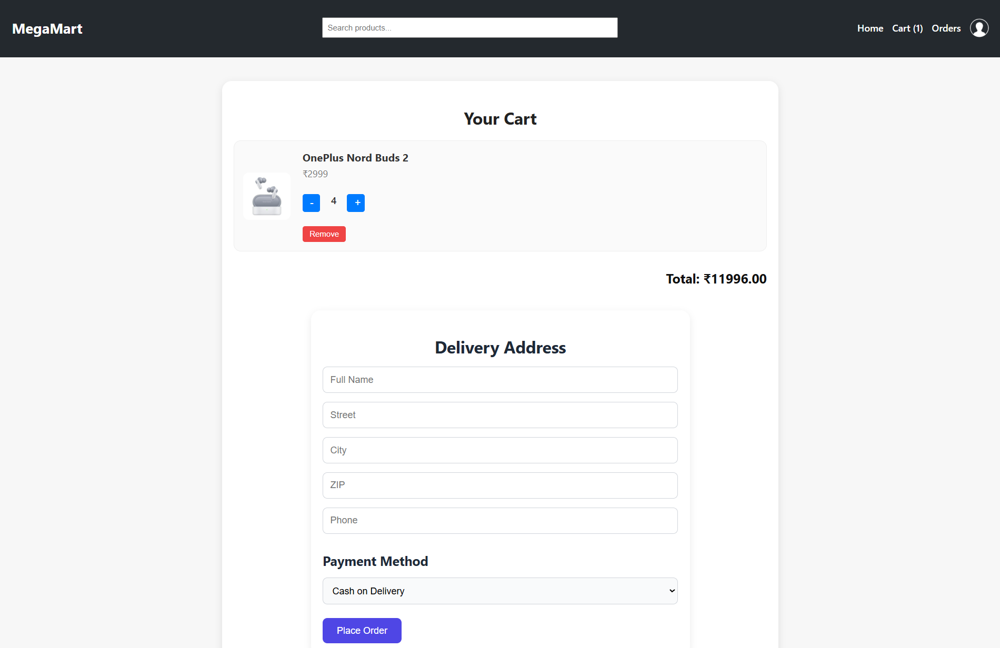
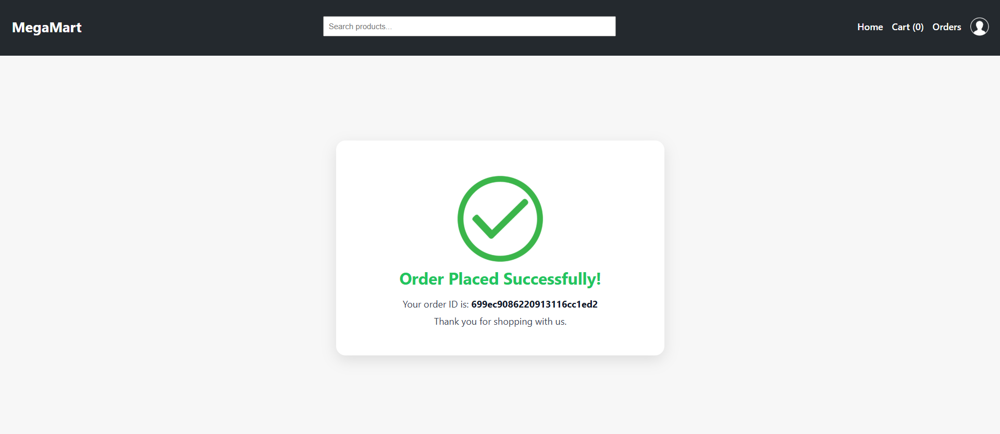
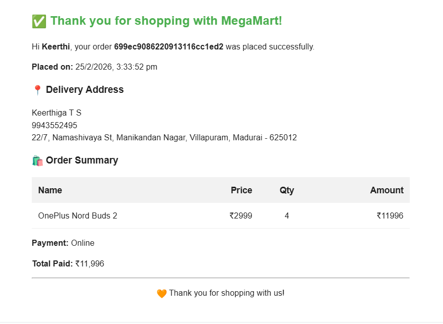
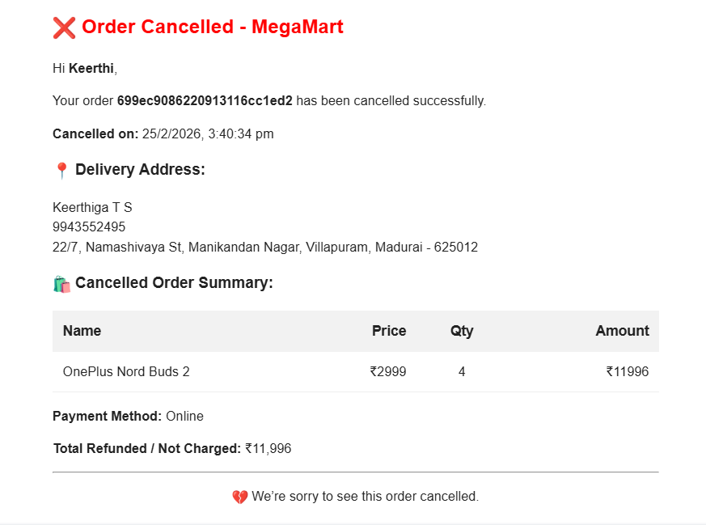

# MegaMart 🛒

MegaMart is a full-stack e-commerce web application designed to provide a seamless and secure online shopping experience. It allows users to browse products, manage their cart, place orders, and track purchase history, while admins can manage products through a dedicated dashboard.

## ✨ Features

### 👤 Authentication & Access Control
- User registration and secure login using JWT authentication  
- Role-based access control (User View & Admin View)  
- Protected routes for authenticated users  

### 🛍 User Functionality
- Browse products with detailed product information  
- Add to cart and manage cart items (update/remove)  
- Delivery address form before placing an order  
- Place orders with payment method selection  
- Order success page after successful purchase  
- View order history  
- Automated confirmation email after order placement  
- Automated cancellation email when order is cancelled  

### 📦 Inventory & Order Management
- Product stock count automatically **reduces after successful order placement**  
- Product stock count automatically **increases when an order is cancelled**  
- Cart clears after successful order  
- Persistent order storage in MongoDB  
- Real-time cart and stock updates  

### 🛠 Admin Functionality
- Admin dashboard for product management  
- Add new products  
- Edit existing product details  
- Delete products  
- Upload and optimize product images using Cloudinary  

---

## 🛠 Tech Stack
- **Frontend:** React.js, HTML, CSS, JavaScript, React Router  
- **Backend:** Node.js, Express.js  
- **Database:** MongoDB  
- **Image Storage:** Cloudinary  
- **Email Service:** Brevo (Sendinblue)  
- **Authentication:** JWT  

---

## 📸 Screenshots

### Login 

### Homepage (User View)

### Homepage (Admin View)

### Product Info page

### Cart

### Order Success Page

### Confirmation Mail

### Order

### Cancellation Mail

---

## 🚀 Live Demo
🔗 https://megamart-frontend-xfxy.onrender.com/

---

## 📌 About the Project

This project was built to gain hands-on experience in full-stack development using the MERN stack. It strengthened my understanding of authentication systems, role-based access control, REST API development, database relationships, inventory management logic, cloud integrations (Cloudinary), email automation (Brevo), and real-world e-commerce workflow implementation.
